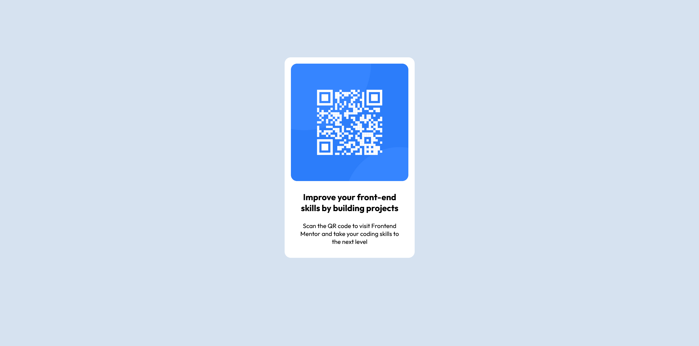

# Frontend Mentor - QR code component solution

This is a solution to the [QR code component challenge on Frontend Mentor](https://www.frontendmentor.io/challenges/qr-code-component-iux_sIO_H). Frontend Mentor challenges help you improve your coding skills by building realistic projects. 

## Table of contents

- [Overview](#overview)
  - [Screenshot](#screenshot)
  - [Links](#links)
- [My process](#my-process)
  - [Built with](#built-with)
  - [What I learned](#what-i-learned)
  - [Continued development](#continued-development)
- [Author](#author)

## Overview

### Screenshot

### Links

- Solution URL: [https://github.com/Alfonso-1701/QR_Code](https://github.com/Alfonso-1701/QR_Code)
- Live Site URL: [https://spectacular-macaron-f480d6.netlify.app](https://spectacular-macaron-f480d6.netlify.app)

## My process

Started mobile first. 

### Built with

- Semantic HTML5 markup
- CSS custom properties
- Flexbox
- CSS Grid
- Mobile-first workflow

### What I learned

Super simple. Finished it in about 15 minutes

### Continued development

Keep focus on mobile first, and commiting after sections are complete.

## Author

- Frontend Mentor - [@Alfonso-1701](https://www.frontendmentor.io/profile/Alfonso-1701)
- LinkedIn - [Alfonso Alvarez](https://www.linkedin.com/in/alfonso-alvarez-4223b628b/)

